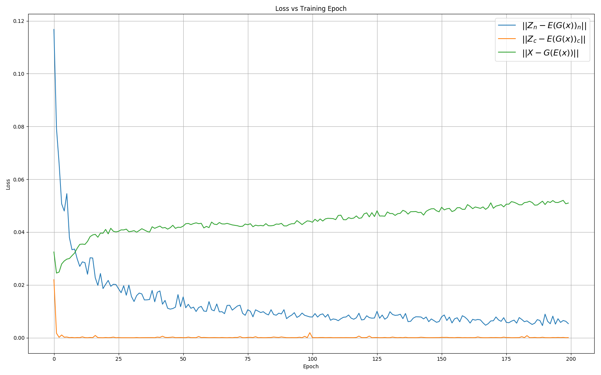
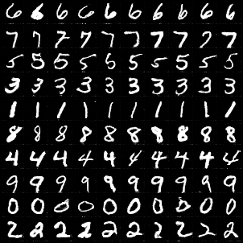
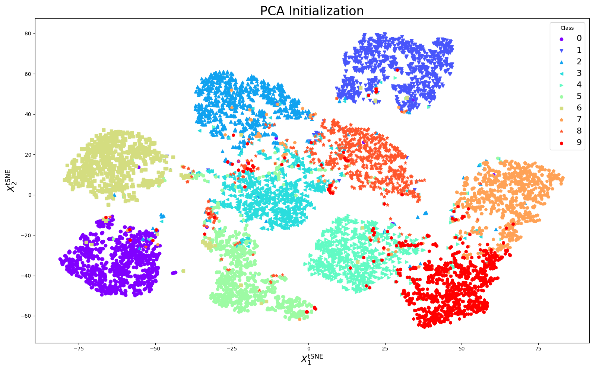

# ClusterGAN: A PyTorch Implementation

This is a PyTorch implementation of [ClusterGAN](https://arxiv.org/abs/1809.03627),
an approach to unsupervised clustering using generative adversarial networks.


## Requirements

The package as well as the necessary requirements can be installed by running `make` or via
```
virtualenv -p /usr/local/bin/python3 venv
source venv/bin/activate
python setup.py install
```

## Run ClusterGAN on MNIST

To run ClusterGAN on the MNIST dataset, ensure the package is setup and then run
```
python train.py -r test_run -s mnist -b 64 -n 300
```
where a directory `runs/mnist/test_run` will be made and contain the generated output
(models, example generated instances, training figures) from the training run.
The `-r` option denotes the run name, `-s` the dataset (currently MNIST and Fashion-MNIST),
`-b` the batch size, and `-n` the number of training epochs.


Below is an example set of training curves for 200 epochs, batch size of 64 on the MNIST dataset.

<p float="left">
  
  
</p>


## Generated Examples
To generate examples from randomly sampled latent space variables, 
```
python gen-examples -r test_run -s mnist -b 100
```

Here are some example generated images by specified class (each row) of the learned labels in latent space.
<p float="left">
  
</p>

## TSNE Figure
To produce a TSNE figure depicting the clustering of the latent space encoding of real images,
```
python tsne-cluster.py -r test_run -s mnist
```

Below is the tSNE clustering figure of the latent space vectors of true MNIST images fed into the encoder.

<p float="left">
  
</p>


## License

[MIT License](LICENSE)

Copyright (c) 2018 Zigfried Hampel-Arias
